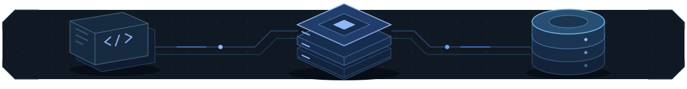

Пишу бэкенд на Go, занимаюсь инфраструктурой.

Внутренняя система компании для обработки лизинговых заявок и документов.
Отвечаю за её бэкенд и инфраструктуру.

Исходный репозиторий закрыт. По ссылке — краткое описание работы и схема архитектуры.

